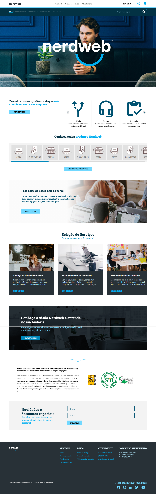

# NerdWeb.

Esta é uma solução para o desafio NerdWeb, proprosto pela empresa NerdWeb.

## :dart: Resumo de conteúdos

- [Visão Geral](#Visão-Geral)
  - [O desafio](#O-desafio)
  - [Captura de tela](#Captura-de-tela)
  - [Links](#Links)
- [Meu processo](#Meu-processo)
  - [Construído com](#Constrído-com)
  - [O que eu aprendi](#O-que-eu-aprendi)
  - [Continuação dos desenvolvimentos](#Continuação-dos-desenvolvimentos)
  - [Recursos utilizados](#Recursos-utilizados)
- [Autor](#Autor)

## Visão Geral.

### :globe_with_meridians: O desafio

Os usuários devem ser capazes de:

- Visualizar o layout ideal para o aplicativo, dependendo do tamanho da tela do dispositivo.
- Visualizar os estados de foco para todos os elementos interativos na página.
- Identificar campos de Input em relação à e-mail e/ou senha obrigatório.
- Visualizar os slides junto com a sua responsividade.
- visualizar efeitos hover nos links do header.

### Captura de tela

- Desktop

  

- Tablet

- Mobile

### Links

- Solução URL: [https://github.com/michelwene/teste-nerdweb](https://github.com/michelwene/teste-nerdweb)
- Site URL: [https://michelwene.github.io/teste-nerdweb/](https://michelwene.github.io/teste-nerdweb/)

## :page_with_curl: Meu processo

### Construído com

- HTML
- CSS
- Javascript
- Swiper
- Design responsivo

### Continuação dos desenvolvimentos

Pretendo continuar fazendo projetos de desafios entre outros.

### Recursos utilizados

- [Developer Mozilla](https://developer.mozilla.org/en-US/docs/Web/JavaScript) - A documentação do Developer Mozilla é essencial para compreender as funções e conseguir aplicar as mesmas no projeto.

- [Swiper](https://swiperjs.com/swiper-api#initialize-swiper)
- Documentação do Swiper para utilização do carrossel.

## :medal_military: Autor

- Linkedin - [@michelwene](https://www.linkedin.com/in/michelwene/)
